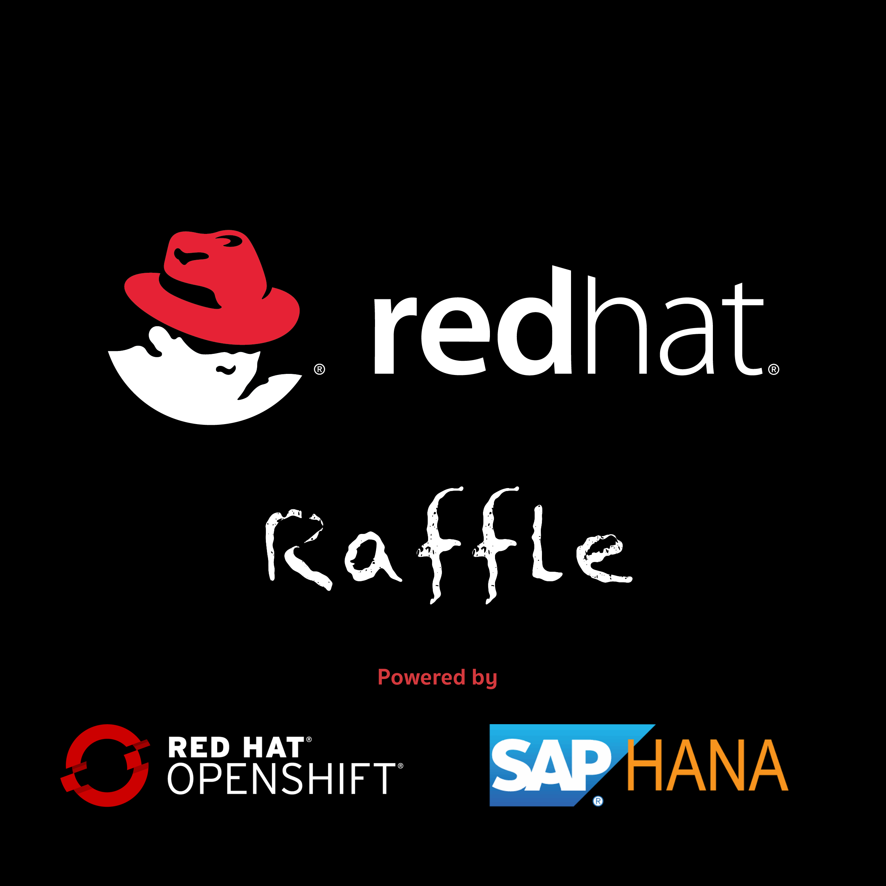

IMPORTANT: Requires Xcode 9.x or greater.

IMPORTANT: Requires ngrok.

IMPORTANT: Requires Maven 3.3 or greater.

IMPORTANT: Requires Openshift 3.7 or greater. I use minishift.

== Cloning the source code
To clone the Raffle project on your local environment:

[source,bash,options="nowrap",subs="attributes+"]
----
$ git clone https://github.com/tejones/redhat-raffle-sap-hana.git

$ cd redhat-raffle-sap-hana
----

== Adding the SAP HANA JDBC jar to your maven repository.
The maven build requires the SAP HANA jdbc jar. If you have not added it to your local or private maven repository you can do so with the following maven command:

[source,bash,options="nowrap",subs="attributes+"]
----
$ mvn install:install-file -Dfile=<path-to-file> -DgroupId=com.sap.db.jdbc -DartifactId=ngdbc.jar -Dversion=4.1 -Dpackaging=jar
----

== Database
To initialize the database:

[source,bash,options="nowrap",subs="attributes+"]
----
Connect to your SAP HANA instance and execute the DDL located in redhat-raffle-sap-hana/raffle-persistance/sql/raffle-hana.ddl. This will create two tables: "attendee" and "event". "attendee" is used for the scanned attendees from the mobile app. The randomized winner will also be determined from this table. The "event" table is there if you would like to create entries and raffles for multiple events. That will need to be wired up if desired since it is not out-of-the-box.
----

== Openshift Project
To create the project on your Openshift Cluster:

[source,bash,options="nowrap",subs="attributes+"]
----
$ oc new-project redhat-raffle --display-name="Red Hat Raffle with SAP HANA" --description="Red Hat Raffle with SAP HANA"
----

== Microservices
IMPORTANT: You will need to update the application-openshift.properties file located in src/main/resources/ with the values for your SAP HANA instance before building and deploying.
[source,bash,options="nowrap",subs="attributes+"]
spring.datasource.url=jdbc:sap://{host:port}
spring.datasource.driver-class-name=com.sap.db.jdbc.Driver
spring.datasource.username={sap_hana_username}
spring.datasource.password={sap_hana_password}

To initialize the microservices:

[source,bash,options="nowrap",subs="attributes+"]
----
$ cd raffle-microservice

$ cd raffle-service
$ mvn clean fabric8:deploy -Popenshift 
$ cd ..
----

== Red Hat Raffle Mobile App
Load the project into Xcode 9.x or greater. Change the event title, dates and location in the EventController.

Install onto iPhone or iPod for the event. Select the event after the app opens. The Scan button will display with scanned attendees. The list will be empty when you first start the app (since you haven't scanned anyone yet). Press the scan button and hold the camera over the barcode or QR Code. The attendee will be added to the attendee list.

== Note: The parsing algorithm in the scan attendee service will likely vary for your event. You may need to adjust accordingly. Email me at tejones@redhat.com if you need help with that.

== Exposing Your Service to the Web and Mobile Application
To allow the web application and mobile application to use you raffle service running on openshift, you need to do two things:
*Port forward:* 
**oc port-forward {raffle-service-pod-name}  8080:8080**

*Install and run ngrok to create a public URL using secure tunneling.* I got the basic account so I could create a subdomain. That way the url will remain constant in the web and mobile applications. To start ngrok tunneling with a subdomain, run:
**./ngrok http -subdomain={subdomain} 8080**

The base endpoint will be http://{subdomain}.ngrok.io

== Web Application
The web app is an HTML5 page that draws a random order list of scanned attendees and iterates through the list until an attendee that is present at the drawing raises their hand, screams, etc.

[source,bash,options="nowrap",subs="attributes+"]

== Using the Web Application:

The web page to draw the winner is at the root of the raffle service host name. From there click on the fireworks background to draw the first random winner. Click on the winner to close. Click on the web page again to draw the next winner. Refreshing the page will generate a new random list of entrants.

